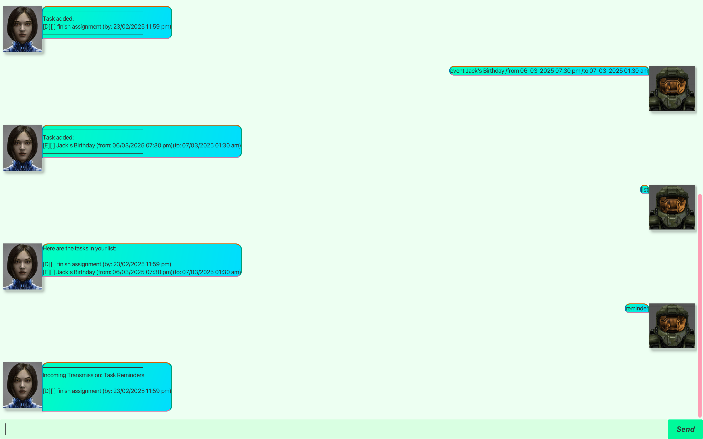

# 📖 Cortana User Guide Summary
Cortana is a command-line assistant that helps you manage tasks efficiently. Designed for **fast** and **intuitive** task management, it combines the **speed of CLI** with the **benefits of a GUI**.

---

## 🚀 **Quick Start**
1. **Download** and run the program.
2. **Use the commands below** to interact with Cortana.
3. Cortana **automatically saves your tasks**.

---

## 🛠 **Features**
### 📌 **Viewing Help**
- **Command:** `help`
- **Description:** Displays the list of available commands.

### ✏️ **Adding a Task**
#### **To-Do**
- **Command:** `todo [task description]`
- **Example:** `todo Finish Halo Campaign`

#### **Deadline**
- **Command:** `deadline [task description] /by [YYYY-MM-DD HH:mm]`
- **Example:** `deadline Submit Report /by 2024-02-20 23:59`

#### **Event**
- **Command:** `event [task description] /from [YYYY-MM-DD HH:mm] /to [YYYY-MM-DD HH:mm]`
- **Example:** `event UNSC Briefing /from 2024-02-21 14:00 /to 2024-02-21 16:00`

### 📋 **Listing All Tasks**
- **Command:** `list`
- **Description:** Displays all tasks in your list.

### ✅ **Marking a Task as Done**
- **Command:** `mark [task number]`
- **Example:** `mark 2`
- **Description:** Marks task `2` as completed.

### ❌ **Unmarking a Task**
- **Command:** `unmark [task number]`
- **Example:** `unmark 2`
- **Description:** Unmarks task `2` as not completed.

### 🔍 **Finding Tasks by Keywords**
- **Command:** `find [keyword]`
- **Example:** `find Halo`
- **Description:** Searches for tasks containing the word `"Halo"`.

### 🗑 **Deleting a Task**
- **Command:** `delete [task number]`
- **Example:** `delete 3`
- **Description:** Removes task `3` from the list.

### 🔥 **Deleting All Tasks**
- **Command:** `delete all`
- **Description:** Clears all tasks.

### ⏰ **Task Reminders**
- **Command:** `reminder`
- **Description:** Displays tasks due within the next **24 hours**.

## ❓ **FAQ**
**Q: How do I undo a command?**  
A: Currently, there is no undo feature. Be careful when deleting tasks.

**Q: How do I manually edit my tasks?**  
A: Open `data/tasks.txt` and modify the entries. Use **caution** to maintain correct formatting.

**Q: How do I exit the program?**  
A: Use the `exit` command.

---

## ⚠️ **Known Issues**
- `find` command is **case-sensitive**.
- Does not support **multiple reminders at different intervals** (coming soon).

---

## 📜 **Command Summary**
| **Command** | **Description** | **Example** |
|------------|----------------|-------------|
| `help` | View available commands | `help` |
| `todo` | Add a To-Do task | `todo Buy milk` |
| `deadline` | Add a Deadline task | `deadline Homework /by 2024-02-20 23:59` |
| `event` | Add an Event task | `event Meeting /from 2024-02-21 14:00 /to 2024-02-21 16:00` |
| `list` | List all tasks | `list` |
| `mark` | Mark a task as done | `mark 2` |
| `unmark` | Unmark a completed task | `unmark 2` |
| `find` | Search tasks by keyword | `find Report` |
| `delete` | Delete a specific task | `delete 3` |
| `delete all` | Delete all tasks | `delete all` |
| `reminder` | Show tasks due in 24 hours | `reminder` |
| `save` | Save the current task list | `save` |
| `exit` | Exit the application | `exit` |

---

